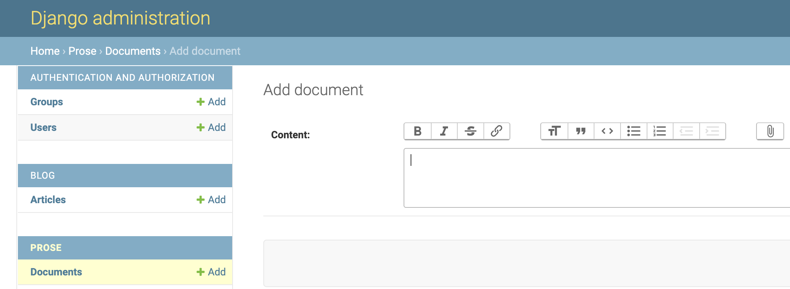

# Django Prose

 

Django Prose provides your Django applications with wonderful rich-text editing capabilities.

## Requirements

- Python 3.8 or later
- Django 3.2 or later
- Bleach 4.0 or later

## Getting started

To get started with Django Prose, first make sure to install it. We use and suggest using Poetry, although Pipenv and pip will work seamlessly as well

```console
poetry add django-prose
```

Then, add `prose` in Django's installed apps (example: [`example/example/settings.py`](https://github.com/withlogicco/django-prose/blob/9e24cc794eae6db48818dd15a483d106d6a99da0/example/example/settings.py#L46)):

```python
INSTALLED_APPS = [
    # Django stock apps (e.g. 'django.contrib.admin')

    'prose',

    # your application's apps
]
```

Last, run migrations so you can use Django Prose's Document model:

```
python manage.py migrate prose
```

Now, you are ready to go 🚀.

## Usage

There are different ways to use Django prose according to your needs. We will examine all of them here.

### Rendering rich-text in templates

Rich text content essentially is HTML. For this reason it needs to be manually marked as [`safe`](https://docs.djangoproject.com/en/4.2/ref/templates/builtins/#safe), when rendered in Django templates. Example:

```django
{{ document.content | safe}}
```

### Small rich-text content

You might want to add rich-text content in a model that is just a few characters (e.g. 140), like an excerpt from an article. In that case we suggest using the `RichTextField`. Example:

```py
from django.db import models
from prose.fields import RichTextField

class Article(models.Model):
    excerpt = RichTextField()
```

As mentioned above, you need to mark the article excerpt as `safe`, in order to render it:

```django
<div class="article-excerpt">{{ article.excerpt | safe}}</div>
```

### Large rich-text content

In case you want to store large rich-text content, like the body of an article, which can span to quite a few thousand characters, we suggest you use the `AbstractDocument` model. This will save large rich-text content in a separate database table, which is better for performance. Example:

```py
from django.db import models
from prose.fields import RichTextField
from prose.models import AbstractDocument

class ArticleContent(AbstractDocument):
    pass

class Article(models.Model):
    excerpt = RichTextField()
    body = models.OneToOneField(ArticleContent, on_delete=models.CASCADE)
```

Similarly here as well, you need to mark the article's body as `safe`, in order to render it:

```django
<div class="article-body">{{ article.body.content | safe}}</div>
```

### Forms with rich-text editing

You can create forms for your Django Prose models, to provide rich-text editing functionality. In that case, you will also need to render `form.media`, to load Trix with its stylesheets.

```django
<form  method="POST" >
  
  
  {{ form.as_p }}
  {{ form.media }}
  
  <button type="submit">Submit</button>
</form>
```

The same is true also, if you are rendering the forms field manually.

### Attachments

Django Prose can also handle uploading attachments with drag and drop. To set this up, first you need to:

- [x] Set up the `MEDIA_ROOT` and `MEDIA_URL` of your Django project (example in [`example/example/settings.py`](https://github.com/withlogicco/django-prose/blob/9e24cc794eae6db48818dd15a483d106d6a99da0/example/example/settings.py#L130-L131)))
- [x] Include the Django Prose URLs (example in [`example/example/urls.py`](https://github.com/withlogicco/django-prose/blob/9e24cc794eae6db48818dd15a483d106d6a99da0/example/example/urls.py#L13-L14))
- [x] (Optional) Set up a different Django storage to store your files (e.g. S3)

### Full example

You can find a full example of a blog, built with Django Prose in the [`example`](./example/) directory.

## 🔒 A note on security

As you can see in the examples above, what Django Prose does is provide you with a user friendly editor ([Trix](https://trix-editor.org/)) for your rich text content and then store it as HTML in your database. Since you will mark this HTML as safe in order to use it in your templates, it needs to be **sanitised**, before it gets stored in the database.

For this reason Django Prose is using [Bleach](https://bleach.readthedocs.io/en/latest/) to only allow the following tags and attributes:

- **Allowed tags**: `p`, `ul`, `ol`, `li`, `strong`, `em`, `div`, `span`, `a`, `blockquote`, `pre`, `figure`, `figcaption`, `br`, `code`, `h1`, `h2`, `h3`, `h4`, `h5`, `h6`, `picture`, `source`, `img`
- **Allowed attributes**: `alt`, `class`, `id`, `src`, `srcset`, `href`, `media`

## Screenshots

### Django Prose Documents in Django Admin



## Real world use cases
- **Remote Work Café**: Used to edit location pagess, like [Amsterdam | Remote Work Café](https://remotework.cafe/locations/amsterdam/)
- In production by multiple clients of [LOGIC](https://withlogic.co), from small companies to the public sector.

If you are using Django Prose in your application too, feek free to open a [Pull Request](https://github.com/withlogicco/django-prose/pulls) to include it here. We would love to have it.

## Development for Django Prose

If you plan to contribute code to Django Prose, this section is for you. All development tooling for Django Prose has been set up with Docker and Development Containers.

To get started run these commands in the provided order:

```console
docker compose run --rm migrate
docker compose run --rm createsuperuser
docker compose up
```

If you are using Visual Studio code, just open this repository in a container using the [`Dev Containers: Open Folder in Container`](https://code.visualstudio.com/docs/devcontainers/containers#_quick-start-open-an-existing-folder-in-a-container).

---

<p align="center">
  <i>🦄 Built with <a href="https://withlogic.co/">LOGIC</a>. 🦄</i>
</p>
